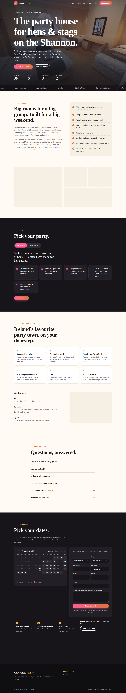

# gasworkshousecarrick.com

A custom one-page WordPress theme for **Gasworks House**, a boutique hen and stag house in Carrick-on-Shannon.



## What's on the page

- **Hero**: headline, key facts (guests, bedrooms, bathrooms, minimum nights) and a booking button
- **The house**: description and a feature checklist
- **Photo tour**: a room-by-room tour of the house (room list, large photo viewer with the room's beds and description, a strip of every photo, and full screen with swipe and arrow keys). Your photos are built in.
- **Hens & stags**: a hen/stag toggle with party ideas for each
- **Carrick-on-Shannon**: things to do, directions and a Google Map
- **Reviews**: hidden until you add real guest reviews
- **FAQ**
- **Direct booking**: a live availability calendar synced with Airbnb, price breakdown and request-to-book (see below)
- A sticky "Book" button on mobile, SEO meta tags and Google structured data (LodgingBusiness)

## Install on Hostinger WordPress

1. Download `gasworks-house.zip` from this folder. If you change the theme, rebuild it with `./build.sh`.
2. In WordPress admin go to **Appearance → Themes → Add New Theme → Upload Theme**, choose the zip, then click **Install Now** and **Activate**.
3. Go to **Appearance → Customize → Gasworks House** and fill in each section:
   - **Booking & contact**: your Airbnb listing URL (shown as a secondary "Prefer Airbnb?" option), email, phone and WhatsApp
   - **The house**: guest numbers, bedrooms, bathrooms, description and features
   - **Photo tour**: optional. Pick up to 20 photos to replace the built-in ones, and label each as `Room | description` (e.g. `The Attic Room | Three singles under the eaves`). Photos with the same room name are grouped together.
   - **Hero & SEO**: the main photo at the top of the page (built in: the kitchen with the stove lit) and your Google description
   - **Things to do & location**: add your address or Eircode for the map
   - **Reviews & FAQ**
4. Your logo and favicon are built in (see Branding below). Set the site title to "Gasworks House Carrick" under **Customize → Site Identity**.
5. If Hostinger's **LiteSpeed Cache** is on, purge the cache after each change (**LiteSpeed Cache → Toolbox → Purge All**).
6. Set up bookings (next section), then send yourself a test request. If the email doesn't arrive, the request is still saved under **Bookings**. For reliable email, set up Hostinger email and an SMTP plugin such as WP Mail SMTP.
7. Under **Settings → General**, set the timezone to **Dublin** so "today" is correct on the calendar.

## Direct booking & Airbnb sync

Everything is under **Bookings → Settings & Airbnb sync** in WordPress.

**Connect Airbnb (two-way calendar sync):**

1. **Airbnb → website:** in Airbnb, open your listing's **Calendar → Availability → Sync calendars → Export calendar**. Copy the link (it looks like `https://www.airbnb.ie/calendar/ical/50016674.ics?s=…`) and paste it into the settings page. Airbnb bookings then block those dates on your website. The site checks every hour, and again just before accepting a request.
2. **Website → Airbnb:** copy the **export link** shown on the settings page. In Airbnb go to **Sync calendars → Import calendar**, paste it and name it "Website". Airbnb then blocks dates booked on your site. Only the dates are shared, never guest details.

Airbnb only re-reads imported calendars every few hours, so there's a small window where someone could book the same dates on Airbnb. Requests are held rather than auto-confirmed, so you'll always spot a clash before confirming, and the Confirm button refuses if the dates now clash.

**How a booking works:**

1. The guest picks dates on the calendar (booked nights are greyed out, and the minimum stay is enforced) and sees the price.
2. They send a request. The dates are **held** (default 3 days) and blocked on your site and on Airbnb, and both of you get an email.
3. In **Bookings**, click **Confirm & email guest**. The guest gets your payment instructions (bank details or a Stripe/Revolut payment link). Or click **Decline**, and they get a polite email.
4. Requests you don't act on expire after the hold period, and the dates free up again.

You can also add phone or email bookings, or block dates for maintenance, with **Bookings → Add booking or block dates**. Without Stripe keys, guests pay using your payment instructions. With Stripe keys, see Online payments below.

**Prices** (already set as the defaults; change them in the settings page):

| | Midweek (Sun–Thu nights) | Weekend (Fri & Sat nights) |
|---|---|---|
| Whole house, up to 12 guests | €500 per night | €700 per night |
| Each guest over 12 | €60 per person per night | €70 per person per night |

Plus a €60 cleaning fee per stay. Example: 20 guests, Friday to Sunday = €1,400 + (8 × €70 × 2) + €60 = **€2,580**.

The €300 damage deposit is a **card pre-authorisation** (a hold, not a charge). It's shown to guests and in emails but isn't added to the total. With Stripe connected, the site places and releases the hold automatically (see Online payments). Without Stripe, place it yourself close to check-in, because card holds lapse after about 7 days.

Prices can't be pulled from Airbnb automatically (Airbnb's calendar link only contains dates), so keep your Airbnb prices in step by hand.

## Online payments (Stripe)

Guests book instantly and pay by card through **Stripe Checkout**. Until you add Stripe keys, the site takes requests instead (see above).

**What happens:**

1. The guest picks dates, enters their group size, optionally adds the Moon River cruise, and clicks **Book & pay**. The dates are held for about 30 minutes while they're on the Stripe payment page.
2. They pay a **30% deposit**, or the full amount if arriving within 14 days. Their card is saved securely at Stripe (never on your site), and the booking is confirmed and emailed straight away.
3. **14 days before arrival**, the balance is charged to the saved card automatically.
4. **The day before arrival**, a **€300 damage-deposit hold** is placed on the card (a hold, not a charge). It's released automatically **2 days after check-out**, unless you capture some or all of it from the booking screen. Card holds lapse after about 7 days, which is why the window is kept short.
5. If a bank asks the guest to approve a charge or hold (common with Irish cards), or a card is declined, the guest is emailed a link to pay, and you're emailed too. The booking screen shows a ⚠️ until it's sorted.

Refunds and cancellations are done in your Stripe dashboard.

**Setup (about 10 minutes):**

1. In Stripe, go to **Developers → API keys** and copy the **test** secret key (`sk_test_…`).
2. In WordPress, go to **Bookings → Settings & Airbnb sync → Online payments** and paste it in. **Never send your keys by email or chat.** To keep keys out of the database, you can instead add `define( 'GWH_STRIPE_SECRET_KEY', 'sk_…' );` and `define( 'GWH_STRIPE_WEBHOOK_SECRET', 'whsec_…' );` to `wp-config.php` (Hostinger → File Manager).
3. In Stripe, go to **Developers → Webhooks → Add endpoint**. Paste the webhook URL shown on the settings page and choose the events `checkout.session.completed`, `checkout.session.async_payment_succeeded` and `checkout.session.expired`. Copy the **Signing secret** (`whsec_…`) into the settings page.
4. Make a test booking on your site with card **4242 4242 4242 4242** (any future expiry date and any CVC). Check the confirmation email and the booking screen. To test a card that needs bank approval, use **4000 0027 6000 3184**.
5. When you're happy, swap in the **live** keys (`sk_live_…`) and create a live-mode webhook the same way. It has a different signing secret.

**Moon River cruise add-on:** €25 per person, and guests choose the headcount (up to their group size) and which day of their stay. It's added to the total and marked "subject to availability"; you book the sailing with Moon River. Change the name, price and text, or switch it off, under **5. Cruise add-on** in the settings.

**Hosting notes:** the balance and hold jobs run on WordPress's scheduler, which is triggered by site visits. For exact timing, set up a Hostinger **Cron Job** that runs every 15 minutes: `wget -q -O - https://gasworkshousecarrick.com/wp-cron.php?doing_wp_cron >/dev/null 2>&1`. Also make sure LiteSpeed Cache doesn't cache `/wp-json/` (it's excluded by default).

## Branding

Your logo is built into the theme in two versions, both in `gasworks-house/assets/brand/`:

- **`logo-light`**: black turned to cream, for the site's dark header and footer. It shows large over the hero photo and shrinks when the visitor scrolls.
- **`logo-dark`**: your original, for light backgrounds. It's used on the WordPress login screen and in Google's structured data.

The **favicon** is the "G" from your logo in flame colours on a dark tile. The full logo can't be read at browser-tab size, but the G stays clear down to 16 pixels in both light and dark browser tabs. The same design is used as the phone home-screen icon. To use a different icon, set one under **Customize → Site Identity → Site Icon**; it overrides the built-in one.

Buttons and highlights use the flame orange and red from the logo. Pink stays on hen-party elements and teal on stag-party ones.

If you upload a logo under **Customize → Site Identity → Logo**, it replaces the built-in one in the header. Use a light version, because the header is dark.

## Photo tour

The built-in tour walks through the house: downstairs, up the stairwell, then upstairs. A photo only appears once its file is in `gasworks-house/assets/img/tour/` (a WebP up to 1800px wide, plus a 720px `-720.webp` thumbnail). Until then, the room shows as a branded card with its name, beds and description, so the room list is always complete.

| # | Room | Photos (✅ = added) |
|---|---|---|
| 01 | Kitchen & living | `kitchen-living` ✅, `kitchen-stove`, `kitchen-dining` |
| 02 | The Long Room (6 single beds) | `long-room` ✅ |
| 03 | The Window Room (4 single beds) | `bedroom-window` ✅, `bedroom-quad` ✅ |
| 04 | The Bunk Room (downstairs, bunk beds) | `bunk-room` |
| 05 | The Stairwell | `stairwell` ✅ |
| 06 | The Mezzanine (upstairs lounge, red sofas) | `mezzanine` ✅ |
| 07 | The Attic Room (3 single beds) | `attic-room` ✅ |
| 08 | The Twin Room (upstairs, 2 single beds) | `twin-room` |
| 09 | Main bathroom | `bathroom` ✅ |
| 10 | Shower room | `shower-room` ✅ |
| 11 | Party room | `party-room` ✅ |

The room names and bed counts come from the photos. Check them against the house, and edit them in `inc/tour.php`, or build your own tour in the Customizer.

## ⚠️ Check the default wording before going live

The site comes filled with starter copy. **Update anything that isn't accurate for your property:**

- 5 bedrooms and 3 bathrooms (sleeps up to 30 is confirmed; the minimum stay is set in the booking settings)
- The feature list. I wrote it from your photos, so add anything else you offer, like Wi-Fi, parking or a speaker
- The FAQ answers and house rules (confetti policy, noise and so on)

Lists in the Customizer use one item per line. Things to do, getting here, reviews and FAQs use the format `Title | Description`.

## Files

```
gasworks-house/
  style.css            theme header
  functions.php        setup, assets, SEO meta and structured data
  front-page.php       the one-page homepage
  header.php, footer.php, index.php, 404.php
  inc/defaults.php     starter copy (you can override all of it in the Customizer)
  inc/customizer.php   Customizer panel
  inc/booking/core.php   availability, pricing, calendar sync (import/export)
  inc/booking/api.php    public API used by the calendar
  inc/booking/admin.php  Bookings screen, confirm/decline, payments panel, settings page
  inc/booking/payments.php  Stripe Checkout, webhook, balance charge, damage hold
  assets/css/main.css
  assets/js/main.js    mobile menu, tabs, lightbox
  assets/js/booking.js availability calendar and booking form
```
